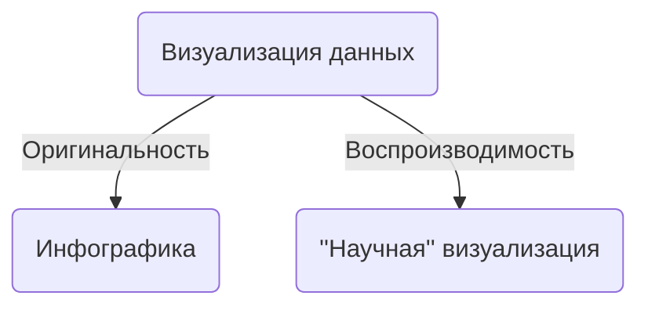

# Введение
 
 
 

## Что такое научная &#8203;&#8203;&#8203;визуализация данных?
 
 
 
 

### Хорошо продуманные визуализации - это самый быстрый способ загрузки информации в наш мозг.*
<figure>
    <figcaption style="color:#b3b3b3ff; font-size: 18px; position: relative; top: 50px; left: 340px;">________________  * Adam Pearce на воркшопе <a href="https://visxai.io">Visualization for AI Explainability (2024)</a>
  </figcaption>
</figure>

---

# Инфографика

 
 

---

# Инфографика

<figure>
  
    <figcaption style="color:#b3b3b3ff; font-size: 11px; position: relative; top: -50px; left: 640px;">Источник изображения: 
    <a href="https://www.behance.net/gallery/10901127/History-of-Life">https://behance.net/gallery/10901127/History-of-Life</a>
  </figcaption>
</figure>

---

# Почему я интересуюсь визуализацией данных?

### Это увлекательно

 
<figure>
  
</figure>

### ... и красиво

 
<figure>
  
    <figcaption style="color:#b3b3b3ff; font-size: 11px; position: relative; top: -60px; left: -400px;">Источник изображения справа: 
    <a href="https://www.datylon.com/blog/types-of-charts-graphs-examples-data-visualization">https://datylon.com/blog/types-of-charts-graphs-examples-data-visualization</a>
  </figcaption>
</figure>

---

# Почему я интересуюсь визуализацией данных?

### Эффективные визуализации усиливают научный доклад
 
<figure>
  
  <figcaption style="color:#b3b3b3ff; font-size: 11px; position: relative; top: -60px; left: 740px;">Источник: слайды Ellis KAY  с конференции <a href="https://indico.in2p3.fr/event/32664/contributions/137079/">Moriond 2024</a>
  </figcaption>
</figure>

<!--
Участвуя во множестве конференций, научных семинарах, защитах и совещаниях, я замечал, что одни докладчики, показывая визуальные материалы, подкрепляют и усиливают основную идею своего доклада, и от этого идея становится запоминающейся. Настолько, что суть некоторых хороших докладов я помню до сих пор. У других докладчиков через визуальные материалы приходилось продираться, они были запутанными, либо несоответствовали произносимым словам. От этого общее впечатление от доклада снижалась, даже если речь была очень хорошей. Такие доклады оказались плохо запомнившимися.
-->

---

# Сколько вы знаете визуализаций?

 
<figure>
  
  <figcaption style="color:#b3b3b3ff; font-size: 11px; position: relative; top: 80px; left: 400px;">Источник изображений: 
    <a href="https://www.datylon.com/blog/types-of-charts-graphs-examples-data-visualization">https://www.datylon.com/blog/types-of-charts-graphs-examples-data-visualization</a>
  </figcaption>
</figure>
 

---

# Сколько вы знали визуализаций в школе?

 
<figure>
  
  <figcaption style="color:#b3b3b3ff; font-size: 11px; position: relative; top: 80px; left: 400px;">Источник изображений: 
    <a href="https://www.datylon.com/blog/types-of-charts-graphs-examples-data-visualization">https://www.datylon.com/blog/types-of-charts-graphs-examples-data-visualization</a>
  </figcaption>
</figure>
 

---

# Сколько вы знаете визуализаций в университете?

 
<figure>
  
  <figcaption style="color:#b3b3b3ff; font-size: 11px; position: relative; top: 80px; left: 400px;">Источник изображений: 
    <a href="https://www.datylon.com/blog/types-of-charts-graphs-examples-data-visualization">https://www.datylon.com/blog/types-of-charts-graphs-examples-data-visualization</a>
  </figcaption>
</figure>
 

---

# Визуализаций намного больше, чем вы думаете

 
<figure>
  
  <figcaption style="color:#b3b3b3ff; font-size: 11px; position: relative; top: 80px; left: 400px;">Источник изображений: 
    <a href="https://www.datylon.com/blog/types-of-charts-graphs-examples-data-visualization">https://www.datylon.com/blog/types-of-charts-graphs-examples-data-visualization</a>
  </figcaption>
</figure>

#### Это только малая часть видов визуализаций в 2D!

---
zoom: 0.84
--- 

# Для чего нужна визуализация данных?

### Компьютерные системы **визуализации** создают наглядные представления наборов данных, позволяя людям выполнять задачи более эффективно
 

<v-clicks depth="2">

* Визуализация подходит, когда необходимо дополнить человеческие возможности, а не заменить людей алгоритмическими методами принятия решений
* Пространство возможных визуальных идиом большое, включает в себя задачи создания визуализаций и взаимодействия человека с визуализациями
* Многие визуализации специфичны для конкретных задач, а для других задач неэффективны
* С визуализацией связаны ограничения:
	* Человека
	* Компьютера
	* Дисплея / бумаги
* Визуальные идиомы можно анализировать
</v-clicks>

<v-click>

### Зачем / почему / для чего...
</v-click>
<v-clicks>

* ... нужен человек в процессе принятия решений?
* ... нужен компьютер?
* ... использовать визуализацию как внешнюю память?
* ... полагаться на зрение?
* ... показывать данные в деталях?
* ... визуальных идиом так много?
* ... применять в конкретных задачах?
* ... многие визуализации неэффективны?
* ... беспокоиться об эффективности визуализаций?
* ... мы сталкиваемся с ограниченными ресурсами?
* ... анализировать визуализации?
</v-clicks>

---

# Когда мы впервые встречаемся с визуализацией данных?

<v-clicks depth="2">

* В каком-то смысле когда начинаем читать
	* Любой текст является знаковой системой

* Чтение музыкального текста
	* Очень близко к рассматриваемым на курсе идиомам визуализации

* В общеобразовательной школе?
	* Например, в 4-м классе  на предмете "Окружающий мир" 
	(фотография тетради Игоря К.)
</v-clicks>

<v-click>
<figure>
  
</figure>
</v-click>

---

# Зачем человек в процессе принятия решений?

 
<figure>
  
  <figcaption style="color:#b3b3b3ff; font-size: 11px; position: relative; top: 40px; left: 10px;">На основе Рис. 1 из <a href="https://link.springer.com/chapter/10.1007/978-3-540-70956-5_7">D. Keim et al, Visual Analytics: Definition, Process, and Challenges (2008)</a>
  </figcaption>
</figure>

---

# Зачем человек в процессе принятия решений?
<v-clicks depth="2">

* Визуализация данных позволяет людям анализировать данные в ситуации, когда заранее неизвестны конкретные вопросы связанные с данными
	* Или когда таких вопросов слишком много
	* Вопросы пока остаются прерогативой человека ☺️

* Мы можем использовать эволюционно приобретенные **способности к нахождению паттернов** нашей зрительной системы
	* Визуализация **дополняет** эти способности

* Визуализация предлагает **исследовательский путь**, нежели алгоритмизированный
	* Тоже свойственно человеку

* Визуализация может применяться для человеческого контроля систем и алгоритмов
</v-clicks>

---

# Зачем компьютер в процессе принятия решений?

<v-clicks depth="2">

* Никто не запрещает создавать визуализации карандашом на бумаге
	* Это очень трудоёмко и медленно для больших наборов данных
		* Некоторые наборы данных изменяются во времени
	* Часто требуется переиспользовать созданную визуализацию для других данных
* Данные зачастую уже в памяти комьютера
* Иногда компьютерная визуализация использует некоторые аспекты нарисованной от руки графики
</v-clicks>

---

# Зачем компьютер в процессе принятия решений?

<figure>
  
  <figcaption style="color:#b3b3b3ff; font-size: 11px; position: relative; top: 20px; left: 10px;">Источник: <a href="https://www.cs.ubc.ca/~tmm/vadbook/">Рис. 1.2. T. Munzner. Visualization Analysis and Design. A K Peters Visualization Series, CRC Press, 2014</a>
  </figcaption>
</figure>

---

# Зачем использовать внешнюю память?

<v-clicks>

* Наша **рабочая память** зависит от задачи и окружающих условий, и **ограничена всего несколькими элементами** [[N. Cowan, 2010](https://pmc.ncbi.nlm.nih.gov/articles/PMC2864034)]

* Использование визуализации позволяет человеку отвлечься от внутреннего познания и применения рабочей памяти в пользу перцептивной системы, используя тщательно разработанные изображения в качестве **внешних представлений**, которые также называют **внешней памятью**

* Внешние представления не ограничиваются визуализацией и могут полагаться на осязание
</v-clicks>

<v-click>
<figure>
  
  <figcaption style="color:#b3b3b3ff; font-size: 11px; position: relative; top: 5px; left: 0px;">Midjourney 6, запрос "hands and abacus"
  </figcaption>
</figure>
</v-click>

<v-click>
<figure>
  
  <figcaption style="color:#b3b3b3ff; font-size: 11px; position: relative; top: 5px; left: 0px;"><a href="https://ru.wikipedia.org/wiki/%D0%9A%D0%B8%D0%BF%D1%83">Кипу</a>. <a href="https://www.invaluable.com/auction-lot/beautiful-large-quipu-552-c-d594d89973">Источник фото</a>. См. также <a href="https://courses.csail.mit.edu/iap/khipu/">курс лекций MIT</a>
  </figcaption>
</figure>
</v-click>

<v-click>
<figure>
  
</figure>
  <figcaption style="color:#b3b3b3ff; font-size: 11px; position: relative; top: 5px; left: 0px;"><a href="https://www.ville-ge.ch/meg/sql/en/musinfo_public.php?id=053477">Навигационная карта с Маршалловых островов.</a> Фото автора
  </figcaption>
</v-click>

<!--
Похоже, в культуре прослеживается общая тенденция ухода от осязаемых инструментов внешней памяти к зрительным.
-->

---

# Зачем использовать внешнюю память?

* Наша *рабочая память* зависит от задачи и окружающих условий, и **ограничена всего несколькими элементами** [[N. Cowan, 2010](https://pmc.ncbi.nlm.nih.gov/articles/PMC2864034)]

* Использование визуализации позволяет человеку отвлечься от внутреннего познания и применения рабочей памяти в пользу перцептивной системы, используя тщательно разработанные изображения в качестве **внешних представлений**, которые также называют **внешней памятью**
<v-clicks depth="3">

* Можно создавать визуализации для поддержки **умозаключений**
	* В визуализации можно использовать такое пространственное расположение объектов,  чтобы ускорить их поиск и распознавание
		* Поиск ускоряется, если **сгруппировать** все объекты, необходимые для конкретного умозаключения
		* Распознавание облегчается, если **сгруппировать** необходимую информацию об одном объекте рядом, избегая сопоставления с элементами, хранящимся в рабочей памяти
</v-clicks>

<!--
Однако неоптимальная схема может группировать нерелевантную информацию или поддерживать перцептивные умозаключения, которые не являются полезными для предполагаемого процесса решения проблемы.
-->

---

# Зачем использовать внешнюю память?

 

<figure>
  
</figure>

<figure>
  
  <figcaption style="color:#b3b3b3ff; font-size: 11px; position: relative; top: 130px; left: -50px;">Источник: И. Чкаников, Час досуга. Занимательные задачи в рисунках, 1947
  </figcaption>
</figure>

 

#### В игре "найдите отличия" внешняя память используется ограниченно

---

# Почему именно зрение?

<v-clicks depth="3">

* Зрительная система человека является высокоскоростным каналом связи с мозгом
	* Мы можем "просканировать" ("окинуть взглядом") большую область зрения благодаря фоновой обработке информации
		* субъективное ощущение, что мы видим все одновременно
		* значительная часть обработки происходит параллельно и без нашего внимания
* Слух обладает более низкой пропускной способностью и другой семантикой
	* Обзор информации не поддерживается из-за последовательности потока звуковой информации
* Осязание
	* Скромные возможности записи/воспроизведения
* Вкус, запах
	* Нет хороших реализаций устройств записи/воспроизведения 
</v-clicks>

---
layout: image

image: /ravel_daphnis_et_chloe.png
backgroundSize: 20em 100%
---

<!--
Возможности параллельного восприятия через зрительную систему иллюстрирует то, как дирижеры читают партитуру. Это страница из партитуры 2-й симфонической сюиты из балета "Дафнис и Хлоя" Мориса Равеля. Дирижеру нужно обрабатывать 40 линий одноверменно. Время звучания, закодированное на этой странице меньше 5 секунд.
-->

---
layout: image

image: /ravel_daphnis_et_chloe_marked.png
backgroundSize: 20em 100%
---

<SlidevVideo v-click controls width="200">
  <!-- Anything that can go in an HTML video element. -->
  <source src="/37322_fragment.mp3" type="audio/mp3" />
  

    Your browser does not support videos. You may download it
    <a href="/37322_fragment.mp3">here</a>.
  

</SlidevVideo>

<figure>
  <figcaption style="color:#b3b3b3ff; font-size: 11px; position: relative; top: 30px; left: 0px;">Морис Равель 
  Cюита для оркестра №2 (1912) 
  из балета "Дафнис и Хлоя" 
  Королевский Филармонический Оркестр  дир. Жан-Клод Казадезюс
  </figcaption>
</figure>

<!--
Цветами обозначены партии, записанные в одном ключе. То есть разным цветам соответствуют разная семантика, то есть одинаковое графическое положение нот будет соответствовать разным звукам.
-->

---
zoom: 0.95
--- 

# Пример: вождение автомобиля

 
<figure>
  
    <figcaption style="color:#b3b3b3ff; font-size: 11px; position: relative; top: 5px; left: 0px;">Midjourney 6, запрос "long-distance driver"
  </figcaption>
</figure>

* Вождение автомобиля требует:
	* "Сканирования" дорожной обстановки
	* Обработку информации в параллельном режиме

* Даже эти когнитивные усилия мозг стремится экономить
 
<v-click>

* NB: Если водитель после долгой дороги не устал, то водитель водит машину недостаточно безопасно*

</v-click>

<v-click>
<figure>
    <figcaption style="color:#b3b3b3ff; font-size: 14px; position: relative; top: -25px; left: 480px;">________________  * См. В. И. Ваганов, А. А. Пинт. Езжу без аварий. М.: 1991, 2009
  </figcaption>
</figure>
</v-click>

---

# Зачем показывать данные в деталях?

* Компьютерные системы **визуализации** создают наглядные представления наборов данных, позволяя людям выполнять задачи более эффективно

<v-clicks depth="2">

* Одним из типов задач является поиск закономерностей (паттернов) в данных с целью:
	* Подтвердить ожидаемое
	* Исключить неожиданное

* Data Science специалисты очень любят смотреть на статистические характеристики наборов данных
	* Например, используя `pandas.DataFrame.describe` в Python
	* Через **обобщение** статистические характеристики **приводят к потере информации**
</v-clicks>

---
zoom: 0.8
--- 

# Зачем показывать данные в деталях?

#### В 1973 году Ф. Дж. Энскомб предложил пример
 

<v-click>

| Характеристика                              | Значение        |
|---------------------------------------------|-----------------|
| Среднее значение переменной $x$             | 9.0             |
| Дисперсия переменной $x$                    | 10.0            |
| Среднее значение переменной $y$             | 7.5             |
| Дисперсия переменной $y$                    | 3.75            |
| Корреляция между  переменными $x$ и $y$  | 0.816           |
| Прямая линейной регрессии                   | $3 + 0.5 x$     |
| Коэффициент детерминации  линейной регрессии | 0.67        |
</v-click>

<v-click>
<figure>
  
  <figcaption style="color:#b3b3b3ff; font-size: 11px; position: relative; top:40px; left: 60px;">Источник: <a href="/https://ru.wikipedia.org/wiki/%D0%9A%D0%B2%D0%B0%D1%80%D1%82%D0%B5%D1%82_%D0%AD%D0%BD%D1%81%D0%BA%D0%BE%D0%BC%D0%B1%D0%B0">https://ru.wikipedia.org/wiki/Квартет_Энскомба</a>
  </figcaption>
</figure>
</v-click>

---
zoom: 0.8
--- 

# Зачем показывать данные в деталях?

#### В 1973 году Ф. Дж. Энскомб предложил пример
 

<figure>
  
</figure>
 

$\bar{x} = 9.0, ~~~~\mathbb{V}x = 10.0, ~~~~\bar{y} = 7.5, ~~~~\mathbb{V}y = 3.75$ 
$r = 0.816, ~~~~y = 3 + 0.5 x, ~~~~R_{\mathrm{reg}}^2 = 0.67$

<figure>
  
  <figcaption style="color:#b3b3b3ff; font-size: 11px; position: relative; top:40px; left: 60px;">Источник: <a href="https://ru.wikipedia.org/wiki/%D0%9A%D0%B2%D0%B0%D1%80%D1%82%D0%B5%D1%82_%D0%AD%D0%BD%D1%81%D0%BA%D0%BE%D0%BC%D0%B1%D0%B0">https://ru.wikipedia.org/wiki/Квартет_Энскомба</a>
  </figcaption>
</figure>

--- 

# Зачем показывать данные в деталях?

<figure>
  
</figure>

$\footnotesize~~~\bar{x} = 54.02$ 
$\footnotesize\mathbb{V}x = 14.52$ 
$\footnotesize~~~\bar{y} = 48.09$ 
$\footnotesize\mathbb{V}y = 24.79$ 
$\footnotesize ~~~r = 0.32$

<figure>
  
</figure>

 
<figure>
  
    <figcaption style="color:#b3b3b3ff; font-size: 11px; position: relative; top:5px; left: 710px;">Источники: <a href="https://en.wikipedia.org/wiki/Datasaurus_dozen">[1]</a>, <a href="https://dl.acm.org/doi/10.1145/3025453.3025912">[2]</a>
  </figcaption>
</figure>

---

# Почему так много видов визуализаций?

 
<figure>
  
  <figcaption style="color:#b3b3b3ff; font-size: 11px; position: relative; top: 80px; left: 400px;">Источник изображений: 
    <a href="https://www.datylon.com/blog/types-of-charts-graphs-examples-data-visualization">https://www.datylon.com/blog/types-of-charts-graphs-examples-data-visualization</a>
  </figcaption>
</figure>

---

# Почему так много видов визуализаций?

* Идиомы визуализации:
	* Создание визуализаций
	* Взаимодействие с визуализациями

* Распространенные виды диаграмм: диаграмма рассеяния, столбчатая, линейная

<figure>
  
<figcaption style="color:#b3b3b3ff; font-size: 11px; position: relative; top: 5px; left: 0px;"><a href = "https://www.datylon.com/blog/types-of-charts-graphs-examples-data-visualization#scatter-plot">Источник изображения</a>
</figcaption>
</figure>

<figure>
  
<figcaption style="color:#b3b3b3ff; font-size: 11px; position: relative; top: 5px; left: 0px;"><a href = "https://www.datylon.com/blog/types-of-charts-graphs-examples-data-visualization#bar-graph">Источник изображения</a>
</figcaption>
</figure>

<figure>
  
<figcaption style="color:#b3b3b3ff; font-size: 11px; position: relative; top: 5px; left: 0px;"><a href = "https://www.datylon.com/blog/types-of-charts-graphs-examples-data-visualization#line-chart">Источник изображения</a>
</figcaption>
</figure>

<!--
Диаграмма рассеяния показывает значения двух числовых переменных, располагая их в виде точек между горизонтальной и вертикальной осями. Простые одноразмерные метки данных дают четкое представление о расположении каждого наблюдения на плоскости двух переменных. Диаграмма рассеяния часто используется для отображения корреляций между числовыми переменными и выявления закономерностей. Будучи «швейцарским ножом» среди диаграмм, диаграмма рассеяния обычно является первой при исследовании данных. Это график с одним из лучших соотношений данных и пространства. Диаграмма рассеяния также известна своей универсальностью. Она дает много вдохновения дизайнерам инфографики и специалистам по визуализации данных. Ее можно превратить практически в любую диаграмму: тепловую карту, точечную диаграмму, диаграмму пиктограмм, карту плиток или какую-нибудь гибридную диаграмму.

Столбчатая диаграмма - это набор прямоугольников, длина которых пропорциональна значениям, которые они представляют. Каждый прямоугольник - столбик - представляет одну категорию. Столбчатые диаграммы отлично подходят для сравнения. Различия в длине столбиков легче воспринимаются, чем, например, различия в размере и цвете.
Столбчатые диаграммы часто используются из-за своей простоты. Зрителям в основном нужно расшифровывать длину и положение столбиков, что делает столбиковые диаграммы очень простыми для понимания. Практически все взрослые люди способны читать столбчатые диаграммы, поэтому не требуется дополнительных знаний в области визуализации данных. По этой причине столбчатые диаграммы отлично справляются со своей задачей. Поэтому, если структура данных и месседж, который вы пытаетесь донести, позволяют это сделать, вам стоит рассмотреть возможность использования столбчатых диаграмм в визуализации данных.
Стоит отметить, что столбчатые диаграммы отображают столбики как вертикально, так и горизонтально. Если вы повернете их на 90 градусов, то снова получите столбчатую диаграмму.

Линейный график - это тип графика, который очень удобен при отображении общих тенденций или прогресса. Линейные графики - один из старейших типов графиков и до сих пор один из самых популярных. Они универсальны, просты и понятны. Они могут отображать сразу много информации. Что действительно хорошо в линейных диаграммах, так это то, что их можно легко наложить или объединить с другими диаграммами, такими как гистограмма или диаграмма областей. На линейной диаграмме точки данных представляют собой два значения и соединены линией, чтобы показать тенденцию изменения данных. Ось x или независимая ось показывает непрерывную переменную (обычно время), а ось y содержит числовое значение зависимой переменной.
-->

---

# Почему так много видов визуализаций?
<v-clicks depth="3">

* Большинство идиом визуализации используют:
	1. Кодирование информации в расположении объектов
		* Абсолютное расположение
		* Относительное расположение
	1. Разделение данных на несколько видов
	1. Сокращение объема отображаемых данных при помощи:
		* Сортировки
		* Агрегирования

* Интерактивные визуализации свободны от показа всей информации сразу и позволяют
	* Исследовать данные с разным уровнем детальности
	* Контролировать представление и обобщение информации
</v-clicks>
---

# Почему так много видов визуализаций?

<v-plotly style="width: 400px !important; height: 190px !important"
:data="[{
x: Array.from({length: 15}, () => Math.random()*4.5),
y: Array.from({length: 15}, () => Math.random()*0),
type: 'scatter',
mode: 'markers',
marker: {color: 'red', size: 10, opacity: 0.5},
showlegend: false
},
{
x: Array.from({length: 15}, () => Math.random()*4.5+5.5),
y: Array.from({length: 15}, () => Math.random()*0),
type: 'scatter',
mode: 'markers',
marker: {color: 'green', size: 10, opacity: 0.5},
showlegend: false
}]"
:layout="{
xaxis: {zeroline: false},
yaxis: {showticklabels: false, showgrid: false},
margin: {l: 10, r:50, pad: 1}
}"
:config="{displayModeBar: false}"
:options="{}"/>

<v-plotly style="height: 250px; position: relative"
:data="[{
x: Array.from({length: 25}, () => Math.random()*0.5),
y: Array.from({length: 25}, () => Math.random()*0.5),
z: Array.from({length: 25}, () => Math.random()*0.5),
type: 'scatter3d',
mode: 'markers',
marker: {color: 'red', size: 4, opacity: 0.5},
showlegend: false
},
{
x: Array.from({length: 15}, () => Math.random()*0.6+0.5),
y: Array.from({length: 15}, () => Math.random()*0.6+0.5),
z: Array.from({length: 15}, () => Math.random()*0.6+0.5),
type: 'scatter3d',
mode: 'markers',
marker: {color: 'green', size: 4, opacity: 0.5},
showlegend: false
}]"
:layout="{
   scene: {camera: {eye: {x: 1.75, y: -1.25, z:1.05}},
            xaxis: {title: 'x1', range: [0.01,1]},
            yaxis: {title: 'x2', range: [0.,1]},
            zaxis: {title: 'x3', range: [0.,1]}},
   margin: {l: 20, r:20, b:20, t:1, pad: 5},
}"
:config="{displayModeBar: false}"
:options="{}"/>

<v-plotly style="width: 400px !important; height: 400px !important"
:data="[{
x: Array.from({length: 25}, () => Math.random()*0.45),
y: Array.from({length: 25}, () => Math.random()*0.45),
type: 'scatter',
mode: 'markers',
marker: {color: 'red', size: 10, opacity: 0.5},
showlegend: false
},
{
x: Array.from({length: 15}, () => Math.random()*0.55+0.5),
y: Array.from({length: 15}, () => Math.random()*0.55+0.5),
type: 'scatter',
mode: 'markers',
marker: {color: 'green', size: 10, opacity: 0.5},
showlegend: false
}]"
:layout="{
xaxis: {title: 'x1'},
yaxis: {title: 'x2'},
margin: {l: 40, r:20, b:70, t:20, pad: 2}
}"
:config="{displayModeBar: false}"
:options="{}"/>

---

# Почему так много видов визуализаций?

 
 

<figure>
  
<figcaption style="color:#b3b3b3ff; font-size: 11px; position: relative; top: 40px; left: 0px;">Источник:  <a href="https://www.cs.ubc.ca/~tmm/vadbook/">Рис. 8.3 (b,c). T. Munzner. Visualization Analysis and Design. A K Peters Visualization Series, CRC Press, 2014</a>
</figcaption>
</figure>

<figure>
  
<figcaption style="color:#b3b3b3ff; font-size: 11px; position: relative; top: 40px; left: 0px;">Источник: <a href = "https://en.wikipedia.org/wiki/Choropleth_map">https://en.wikipedia.org/wiki/Choropleth_map</a>
</figcaption>
</figure>

---
zoom: 1.2
---

# Для чего фокусировать применение визуализации на конкретных задачах?
 
 

* Визуализация, хорошо подходящая для одной задачи, может не подходить для другой задачи, даже если применяется **для одного и того же набора данных**
	* В другой задаче могут интересовать иные аспекты данных

---

# Для чего стремиться к эффективным визуализациям?

### Фокус на эффективности является следствием того, что визуализация важна для принятия решений
<v-clicks depth="2">

* Корректность, точность и истинность играют в визуализации первостепенную роль
	* Корректное изображение не означает отсутствия искажений

* Акценты в визуализации отличаются от других областей, которые также связаны с созданием изображений:
	* В изобразительном искусстве акцент делается на передаче эмоций, эстетическом наслаждении или стимулировании размышлений
	* В кинематографе аналогично + на развертывании повествования
	* В рекламе - на создании настроения или формировании интереса к продукту
</v-clicks>

---
zoom: 0.86
---

# Корректное изображение не означает отсутствия искажений

<figure>
  
<figcaption style="color:#b3b3b3ff; font-size: 11px; position: relative; top: 20px; left: 0px;">Соотношения между площадью каждой страны в проекции Меркатора и истинной площадью. Источник:
<a href = "https://ru.wikipedia.org/wiki/%D0%9F%D1%80%D0%BE%D0%B5%D0%BA%D1%86%D0%B8%D1%8F_%D0%9C%D0%B5%D1%80%D0%BA%D0%B0%D1%82%D0%BE%D1%80%D0%B0">https://ru.wikipedia.org/wiki/Проекция_Меркатора</a>
</figcaption>
</figure>

---

# Акценты в изображениях

<v-click>	
<figure>
  
<figcaption style="color:#b3b3b3ff; font-size: 11px; position: relative; top: 5px; left: 0px;"><a href = "https://ru.wikipedia.org/wiki/%D0%91%D0%B5%D0%BB%D0%BB%D0%B8%D0%BD%D0%B8,_%D0%94%D0%B6%D0%BE%D0%B2%D0%B0%D0%BD%D0%BD%D0%B8">Джованни Беллини. Автопортрет (1511-12)</a>
</figcaption>
</figure>
</v-click>

<v-click>	
<figure>
  
<figcaption style="color:#b3b3b3ff; font-size: 11px; position: relative; top: 5px; left: 0px;"><a href = "https://ru.wikipedia.org/wiki/%D0%9A%D0%B0%D1%80%D0%BC%D0%B0%D0%BD%D0%BD%D0%B8%D0%BA_(%D1%84%D0%B8%D0%BB%D1%8C%D0%BC)">Робер Брессон. "Карманник" (1959)</a>
</figcaption>
</figure>
</v-click>

<v-click>	
<figure>
  
<figcaption style="color:#b3b3b3ff; font-size: 11px; position: relative; top: 5px; left: 0px;">Реклама кетчупа. McCann Erickson (~2010)
</figcaption>
</figure>
</v-click>

---
zoom: 1.2
---

# Для чего стремиться к эффективным визуализациям?

* Для достижения целей эмоционального вовлечения и сохранения повествовательной нити **преднамеренное искажение** и даже **подтасовка фактов** часто вполне уместны в других областях, связанных с созданием изображений, но **не в визуализации данных**
	* Художественная свобода создателя визуализации сильно ограничена
	* Фраза "дело не только в том, чтобы делать красивые картинки" означает, что цели создателя визуализации не достигнуты, если результат красив, но не эффективен

---
zoom: 0.9
---

# В изобразительном искусстве тоже есть исключения

<figure>
  
<figcaption style="color:#b3b3b3ff; font-size: 11px; position: relative; top: -100px; left: 720px;">Алессандро Спекки.  "Площадь и храм Санта Мария делла Ротонда,  некогда древний Пантеон".  Лист из серии римских видов (1693).  Офорт из собрания М. Б. Атаянца
</figcaption>
</figure>

---
zoom: 0.9
---

# Почему мы сталкиваемся с ограниченными ресурсами?
<v-clicks depth="3">

* Ограничения человека
	* Время
	* Память
	* Внимание

* Ограничения компьютера
	* Время выполнения вычислений
	* Память

* Ограничения дисплея (бумаги)
	* Каждый пиксель ценен
	* **Плотность информации** - доля занятого информацией пространства относительно всей доступной площади визуализации
		* Компромисс между загромождением и пустой тратой пространства
		* Задача найти оптимальный вариант между плотным и разреженным пространством
</v-clicks>

---
zoom: 0.9
---

# Для чего анализировать визуализации?

 

* Помогает структурировать большое пространство вариантов
* Большинство визуализаций неэффективны для конкретной задачи/сочетания данных
* Анализ существующих визуализаций является основой к разработке новых

<figure>
  
<figcaption style="color:#b3b3b3ff; font-size: 11px; position: relative; top: 40px; left: 90px;">Источник изображений:  <a href="https://www.cs.ubc.ca/~tmm/vadbook/">Рис. 3.8 и 3.9. T. Munzner. Visualization Analysis and Design. 2014</a>
</figcaption>
</figure>

 
<figure>
  
</figure>
